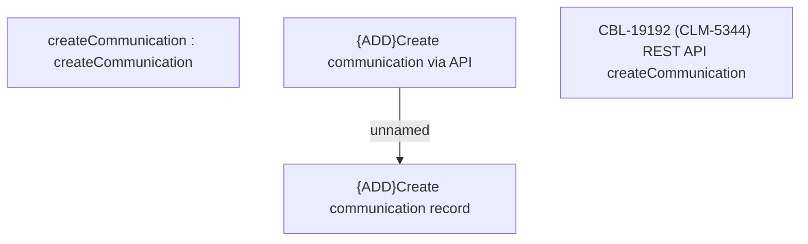

# CBL-19192 (CLM-5344) REST API createCommunication

```mermaid
graph TD
    ADD_Create_communication_record["{ADD}Create communication record"]
    createCommunication_createCommunication["createCommunication : createCommunication"]
    ADD_Create_communication_via_API["{ADD}Create communication via API"]
    CBL_19192_CLM_5344_REST_API_createCommunication["CBL-19192 (CLM-5344) REST API createCommunication"]
    ADD_Create_communication_via_API -->|unnamed| ADD_Create_communication_record
```
