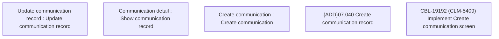

# CBL-19192 (CLM-5409) Implement Create communication screen

```mermaid
graph TD
    Update_communication_record_Update_communication_record["Update communication record : Update communication record"]
    Communication_detail_Show_communication_record["Communication detail : Show communication record"]
    Create_communication_Create_communication["Create communication : Create communication"]
    ADD_07_040_Create_communication_record["{ADD}07.040 Create communication record"]
    CBL_19192_CLM_5409_Implement_Create_communication_screen["CBL-19192 (CLM-5409) Implement Create communication screen"]
```
