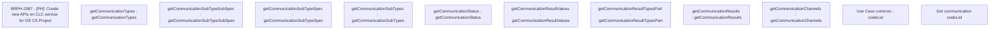

# CBL-29618 - Create new APIs on CLC for OS CS project

```mermaid
graph TD
    BRPH_2087_PH_Create_new_APIs_on_CLC_service_for_OS_CS_Projec["BRPH-2087 - [PH]: Create new APIs on CLC service for OS CS Project"]
    getCommunicationTypes_getCommunicationTypes["getCommunicationTypes : getCommunicationTypes"]
    getCommunicationSubTypeSubSpec_getCommunicationSubTypeSubSpe["getCommunicationSubTypeSubSpec : getCommunicationSubTypeSubSpec"]
    getCommunicationSubTypeSpec_getCommunicationSubTypeSpec["getCommunicationSubTypeSpec : getCommunicationSubTypeSpec"]
    getCommunicationSubTypes_getCommunicationSubTypes["getCommunicationSubTypes : getCommunicationSubTypes"]
    getCommunicationStatus_getCommunicationStatus["getCommunicationStatus : getCommunicationStatus"]
    getCommunicationResultValues_getCommunicationResultValues["getCommunicationResultValues : getCommunicationResultValues"]
    getCommunicationResultTypesPart_getCommunicationResultTypesP["getCommunicationResultTypesPart : getCommunicationResultTypesPart"]
    getCommunicationResults_getCommunicationResults["getCommunicationResults : getCommunicationResults"]
    getCommunicationChannels_getCommunicationChannels["getCommunicationChannels : getCommunicationChannels"]
    Use_Case_common_codeList["Use Case common : codeList"]
    Get_communication_codeList["Get communication codeList"]
```
