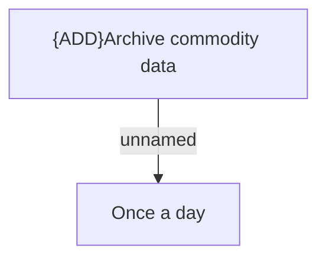

# Automatic jobs

- **Diagram Type**: Custom
- **Package**: HomerSelect/BSL/Modules/Commodity/Analytical Model/COMMON for Commodity/Automatic jobs
- **Diagram ID**: 161934
- **Elements**: 2
- **Connectors**: 1

