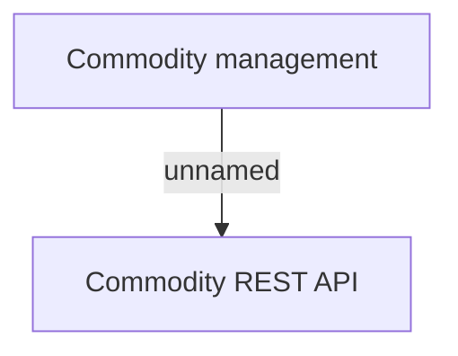

# User Interface

- **Diagram Type**: Custom
- **Package**: HomerSelect/BSL/Modules/Commodity/Analytical Model/COMMON for Commodity/User Interface
- **Diagram ID**: 141022
- **Elements**: 2
- **Connectors**: 1

