# Access Rights

- **Diagram Type**: Custom
- **Package**: HomerSelect/BSL/Modules/Commodity/Analytical Model/Commodity Data/Access Rights
- **Diagram ID**: 161859
- **Elements**: 22
- **Connectors**: 11

```mermaid
graph TD
    ADD_01_630_Archive_commodity["{ADD}01.630 Archive commodity"]
    ADD_01_630_Archive_commodity["{ADD}01.630 Archive commodity"]
    Cancel_external_validation["Cancel external validation"]
    ADD_01_620_Cancel_external_validation["{ADD}01.620 Cancel external validation"]
    DEL_01_698_Provide_commodity_validation_data_for_external_sy["{DEL}01.698 Provide commodity validation data for external systems"]
    n_01_698_Provide_commodity_validation_data_for_external_syst["01.698 Provide commodity validation data for external systems"]
    n_01_697_Archive_commodity_data_from_external_systems["01.697 Archive commodity data from external systems"]
    DEL_01_697_Archive_commodity_data_from_external_systems["{DEL}01.697 Archive commodity data from external systems"]
    n_01_696_Search_commodity_data_from_external_systems["01.696 Search commodity data from external systems"]
    DEL_01_696_Search_commodity_data_from_external_systems["{DEL}01.696 Search commodity data from external systems"]
    n_01_695_Provide_commodity_data_code_lists_for_external_syst["01.695 Provide commodity data code lists for external systems"]
    DEL_01_695_Provide_commodity_data_code_lists_for_external_sy["{DEL}01.695 Provide commodity data code lists for external systems"]
    DEL_01_694_Create_commodity_data_from_external_systems["{DEL}01.694 Create commodity data from external systems"]
    n_01_694_Create_commodity_data_from_external_systems["01.694 Create commodity data from external systems"]
    n_01_693_Validate_commodity_data_from_external_systems["01.693 Validate commodity data from external systems"]
    DEL_01_693_Validate_commodity_data_from_external_systems["{DEL}01.693 Validate commodity data from external systems"]
    n_01_692_Update_commodity_data_from_external_systems["01.692 Update commodity data from external systems"]
    DEL_01_692_Update_commodity_data_from_external_systems["{DEL}01.692 Update commodity data from external systems"]
    DEL_01_691_Provide_commodity_data_for_update_from_external_s["{DEL}01.691 Provide commodity data for update from external systems"]
    n_01_691_Provide_commodity_data_for_update_from_external_sys["01.691 Provide commodity data for update from external systems"]
    n_01_690_Provide_commodity_data_for_external_systems["01.690 Provide commodity data for external systems"]
    DEL_01_690_Provide_commodity_data_for_external_systems["{DEL}01.690 Provide commodity data for external systems"]
    DEL_01_696_Search_commodity_data_from_external_systems -->|unnamed| n_01_696_Search_commodity_data_from_external_systems
    DEL_01_692_Update_commodity_data_from_external_systems -->|unnamed| n_01_692_Update_commodity_data_from_external_systems
    Cancel_external_validation -->|unnamed| ADD_01_620_Cancel_external_validation
    DEL_01_690_Provide_commodity_data_for_external_systems -->|unnamed| n_01_690_Provide_commodity_data_for_external_systems
    ADD_01_630_Archive_commodity -->|unnamed| ADD_01_630_Archive_commodity
    DEL_01_695_Provide_commodity_data_code_lists_for_external_sy -->|unnamed| n_01_695_Provide_commodity_data_code_lists_for_external_syst
    DEL_01_694_Create_commodity_data_from_external_systems -->|unnamed| n_01_694_Create_commodity_data_from_external_systems
    DEL_01_693_Validate_commodity_data_from_external_systems -->|unnamed| n_01_693_Validate_commodity_data_from_external_systems
    DEL_01_697_Archive_commodity_data_from_external_systems -->|unnamed| n_01_697_Archive_commodity_data_from_external_systems
    DEL_01_691_Provide_commodity_data_for_update_from_external_s -->|unnamed| n_01_691_Provide_commodity_data_for_update_from_external_sys
    DEL_01_698_Provide_commodity_validation_data_for_external_sy -->|unnamed| n_01_698_Provide_commodity_validation_data_for_external_syst
```

