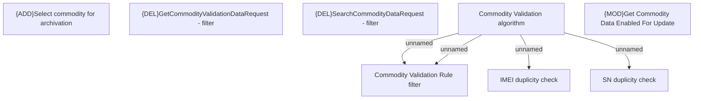

# Business Rules

- **Diagram Type**: Custom
- **Package**: HomerSelect/BSL/Modules/Commodity/Analytical Model/Commodity Data/Business Rules
- **Diagram ID**: 164429
- **Elements**: 8
- **Connectors**: 4

