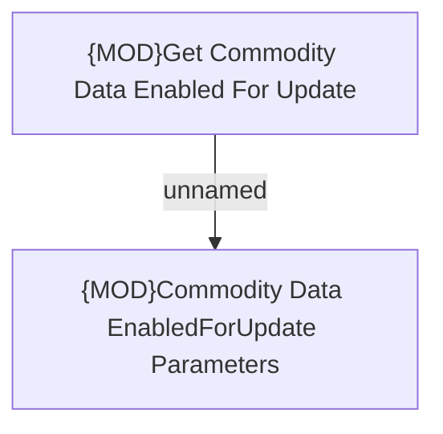

# Commodity Data Customization

- **Diagram Type**: Custom
- **Package**: HomerSelect/BSL/Modules/Commodity/Analytical Model/Commodity Data/Customization
- **Diagram ID**: 164423
- **Elements**: 2
- **Connectors**: 1

