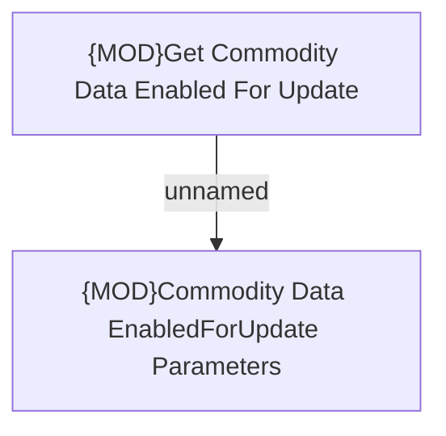

# Commodity Data Customization

```mermaid
graph TD
    MOD_Commodity_Data_EnabledForUpdate_Parameters["{MOD}Commodity Data EnabledForUpdate Parameters"]
    MOD_Get_Commodity_Data_Enabled_For_Update["{MOD}Get Commodity Data Enabled For Update"]
    MOD_Get_Commodity_Data_Enabled_For_Update -->|unnamed| MOD_Commodity_Data_EnabledForUpdate_Parameters
```
