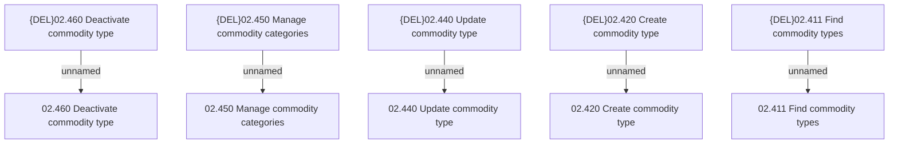

# Access Rights - GUI

```mermaid
graph TD
    DEL_02_460_Deactivate_commodity_type["{DEL}02.460 Deactivate commodity type"]
    n_02_460_Deactivate_commodity_type["02.460 Deactivate commodity type"]
    n_02_450_Manage_commodity_categories["02.450 Manage commodity categories"]
    n_02_440_Update_commodity_type["02.440 Update commodity type"]
    n_02_420_Create_commodity_type["02.420 Create commodity type"]
    n_02_411_Find_commodity_types["02.411 Find commodity types"]
    DEL_02_450_Manage_commodity_categories["{DEL}02.450 Manage commodity categories"]
    DEL_02_440_Update_commodity_type["{DEL}02.440 Update commodity type"]
    DEL_02_420_Create_commodity_type["{DEL}02.420 Create commodity type"]
    DEL_02_411_Find_commodity_types["{DEL}02.411 Find commodity types"]
    DEL_02_420_Create_commodity_type -->|unnamed| n_02_420_Create_commodity_type
    DEL_02_440_Update_commodity_type -->|unnamed| n_02_440_Update_commodity_type
    DEL_02_460_Deactivate_commodity_type -->|unnamed| n_02_460_Deactivate_commodity_type
    DEL_02_450_Manage_commodity_categories -->|unnamed| n_02_450_Manage_commodity_categories
    DEL_02_411_Find_commodity_types -->|unnamed| n_02_411_Find_commodity_types
```
