# List of Commodity Types

- **Diagram Type**: Custom
- **Package**: HomerSelect/BSL/Modules/Commodity/Analytical Model/Commodity Definition/User Interface
- **Diagram ID**: 140919
- **Elements**: 11
- **Connectors**: 8

```mermaid
graph TD
    DEL_02_460_Deactivate_commodity_type["{DEL}02.460 Deactivate commodity type"]
    Set_Commodity_Type_Set_Commodity_Type["Set Commodity Type : Set Commodity Type"]
    Manage_Commodity_Categories_Manage_Commodity_Categories["Manage Commodity Categories : Manage Commodity Categories"]
    DEL_02_450_Manage_commodity_categories["{DEL}02.450 Manage commodity categories"]
    DEL_02_440_Update_commodity_type["{DEL}02.440 Update commodity type"]
    DEL_02_420_Create_commodity_type["{DEL}02.420 Create commodity type"]
    DEL_02_411_Find_commodity_types["{DEL}02.411 Find commodity types"]
    Create_commodity_type["Create commodity type"]
    Manage_commodity_categories["Manage commodity categories"]
    List_of_Commodity_types["List of Commodity types"]
    Commodity_types["Commodity types"]
    Commodity_types -->|unnamed| DEL_02_411_Find_commodity_types
    Create_commodity_type -->|unnamed| DEL_02_420_Create_commodity_type
    List_of_Commodity_types -->|unnamed| DEL_02_440_Update_commodity_type
    Manage_commodity_categories -->|unnamed| DEL_02_450_Manage_commodity_categories
    Manage_commodity_categories -->|unnamed| Manage_Commodity_Categories_Manage_Commodity_Categories
    Create_commodity_type -->|unnamed| Set_Commodity_Type_Set_Commodity_Type
    List_of_Commodity_types -->|unnamed| Set_Commodity_Type_Set_Commodity_Type
    List_of_Commodity_types -->|unnamed| DEL_02_460_Deactivate_commodity_type
```

