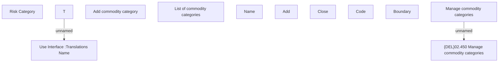

# Manage Commodity Categories

- **Diagram Type**: Custom
- **Package**: HomerSelect/BSL/Modules/Commodity/Analytical Model/Commodity Definition/User Interface
- **Diagram ID**: 140918
- **Elements**: 12
- **Connectors**: 2

