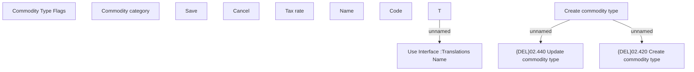

# Set Commodity Type

```mermaid
graph TD
    Commodity_Type_Flags["Commodity Type Flags"]
    Commodity_category["Commodity category"]
    Use_Interface_Translations_Name["Use Interface :Translations Name"]
    DEL_02_420_Create_commodity_type["{DEL}02.420 Create commodity type"]
    DEL_02_440_Update_commodity_type["{DEL}02.440 Update commodity type"]
    Save["Save"]
    Cancel["Cancel"]
    Tax_rate["Tax rate"]
    Name["Name"]
    Code["Code"]
    T["T"]
    Create_commodity_type["Create commodity type"]
    Create_commodity_type -->|unnamed| DEL_02_440_Update_commodity_type
    Create_commodity_type -->|unnamed| DEL_02_420_Create_commodity_type
    T -->|unnamed| Use_Interface_Translations_Name
```
