# Search Commodity Validation Rule

- **Diagram Type**: Custom
- **Package**: HomerSelect/BSL/Modules/Commodity/Analytical Model/Commodity Validation Setting/UI for Commodity Validation Setting/User Interface
- **Diagram ID**: 119670
- **Elements**: 24
- **Connectors**: 3

```mermaid
graph TD
    ADD_Commodity_insurance["{ADD}Commodity insurance"]
    ADD_Financing_package["{ADD}Financing package"]
    ADD_Manufacturer["{ADD}Manufacturer"]
    ADD_Commodity_type["{ADD}Commodity type"]
    ADD_Product["{ADD}Product"]
    ADD_Event_type["{ADD}Event type"]
    Criterias["Criterias"]
    User_Interface_Show_Commodity_Validation_Rule["User Interface : Show Commodity Validation Rule"]
    User_Interface_Set_Commodity_Validation_Rule["User Interface : Set Commodity Validation Rule"]
    External_Type["External Type"]
    Type["Type"]
    Valid_on["Valid on"]
    DEL_01_615_Show_Commodity_Validation_Rule_detail_UI["{DEL}01.615 Show Commodity Validation Rule detail UI"]
    DEL_01_613_Search_Commodity_Validation_Rule_UI["{DEL}01.613 Search Commodity Validation Rule UI"]
    DEL_01_611_Create_new_Commodity_Validation_Rule_UI["{DEL}01.611 Create new Commodity Validation Rule UI"]
    Reset["Reset"]
    Search["Search"]
    Search_buttons["Search buttons"]
    Name["Name"]
    Code["Code"]
    Search_for_Commodity_Validation_Rules_criteria["Search for Commodity Validation Rules criteria"]
    Create_Commodity_Validation_Rule["Create Commodity Validation Rule"]
    List_of_Commodity_Validation_Rules["List of Commodity Validation Rules"]
    Search_Commodity_Validation_Rule["Search Commodity Validation Rule"]
    Create_Commodity_Validation_Rule -->|unnamed| DEL_01_611_Create_new_Commodity_Validation_Rule_UI
    Search_Commodity_Validation_Rule -->|unnamed| DEL_01_613_Search_Commodity_Validation_Rule_UI
    List_of_Commodity_Validation_Rules -->|unnamed| DEL_01_615_Show_Commodity_Validation_Rule_detail_UI
```

