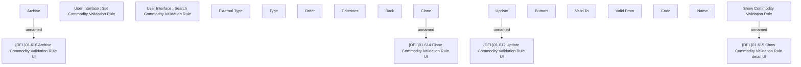

# Show Commodity Validation Rule

```mermaid
graph TD
    Archive["Archive"]
    DEL_01_616_Archive_Commodity_Validation_Rule_UI["{DEL}01.616 Archive Commodity Validation Rule UI"]
    DEL_01_615_Show_Commodity_Validation_Rule_detail_UI["{DEL}01.615 Show Commodity Validation Rule detail UI"]
    DEL_01_614_Clone_Commodity_Validation_Rule_UI["{DEL}01.614 Clone Commodity Validation Rule UI"]
    DEL_01_612_Update_Commodity_Validation_Rule_UI["{DEL}01.612 Update Commodity Validation Rule UI"]
    User_Interface_Set_Commodity_Validation_Rule["User Interface : Set Commodity Validation Rule"]
    User_Interface_Search_Commodity_Validation_Rule["User Interface : Search Commodity Validation Rule"]
    External_Type["External Type"]
    Type["Type"]
    Order["Order"]
    Criterions["Criterions"]
    Criterions["Criterions"]
    Back["Back"]
    Clone["Clone"]
    Update["Update"]
    Buttons["Buttons"]
    Valid_To["Valid To"]
    Valid_From["Valid From"]
    Code["Code"]
    Name["Name"]
    Show_Commodity_Validation_Rule["Show Commodity Validation Rule"]
    Update -->|unnamed| DEL_01_612_Update_Commodity_Validation_Rule_UI
    Clone -->|unnamed| DEL_01_614_Clone_Commodity_Validation_Rule_UI
    Show_Commodity_Validation_Rule -->|unnamed| DEL_01_615_Show_Commodity_Validation_Rule_detail_UI
    Archive -->|unnamed| DEL_01_616_Archive_Commodity_Validation_Rule_UI
```
