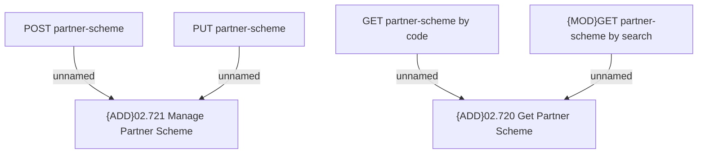

# Access Rights

```mermaid
graph TD
    PUT_partner_scheme["PUT partner-scheme"]
    MOD_GET_partner_scheme_by_search["{MOD}GET partner-scheme by search"]
    GET_partner_scheme_by_code["GET partner-scheme by code"]
    POST_partner_scheme["POST partner-scheme"]
    ADD_02_720_Get_Partner_Scheme["{ADD}02.720 Get Partner Scheme"]
    ADD_02_721_Manage_Partner_Scheme["{ADD}02.721 Manage Partner Scheme"]
    POST_partner_scheme -->|unnamed| ADD_02_721_Manage_Partner_Scheme
    PUT_partner_scheme -->|unnamed| ADD_02_721_Manage_Partner_Scheme
    GET_partner_scheme_by_code -->|unnamed| ADD_02_720_Get_Partner_Scheme
    MOD_GET_partner_scheme_by_search -->|unnamed| ADD_02_720_Get_Partner_Scheme
```
