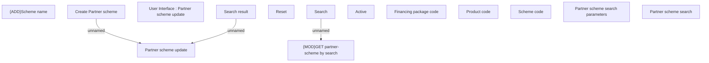

# Partner scheme search

- **Diagram Type**: Custom
- **Package**: HomerSelect/BSL/Modules/Commodity/Analytical Model/Partner scheme code/User Interface
- **Diagram ID**: 158957
- **Elements**: 14
- **Connectors**: 3

