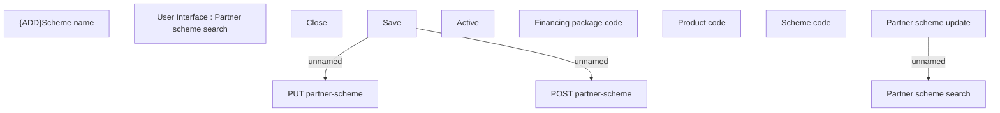

# Partner scheme update

```mermaid
graph TD
    ADD_Scheme_name["{ADD}Scheme name"]
    POST_partner_scheme["POST partner-scheme"]
    Partner_scheme_search["Partner scheme search"]
    User_Interface_Partner_scheme_search["User Interface : Partner scheme search"]
    PUT_partner_scheme["PUT partner-scheme"]
    Close["Close"]
    Save["Save"]
    Active["Active"]
    Financing_package_code["Financing package code"]
    Product_code["Product code"]
    Scheme_code["Scheme code"]
    Partner_scheme_update["Partner scheme update"]
    Save -->|unnamed| PUT_partner_scheme
    Partner_scheme_update -->|unnamed| Partner_scheme_search
    Save -->|unnamed| POST_partner_scheme
```
