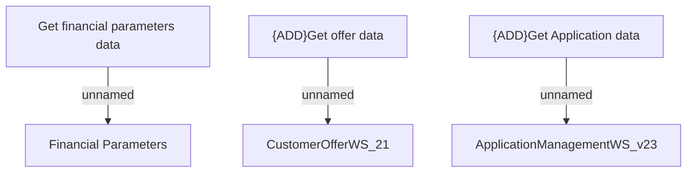

# Business Rules

```mermaid
graph TD
    Financial_Parameters["Financial Parameters"]
    Get_financial_parameters_data["Get financial parameters data"]
    CustomerOfferWS_21["CustomerOfferWS_21"]
    ADD_Get_offer_data["{ADD}Get offer data"]
    ApplicationManagementWS_v23["ApplicationManagementWS_v23"]
    ADD_Get_Application_data["{ADD}Get Application data"]
    Get_financial_parameters_data -->|unnamed| Financial_Parameters
    ADD_Get_Application_data -->|unnamed| ApplicationManagementWS_v23
    ADD_Get_offer_data -->|unnamed| CustomerOfferWS_21
```
