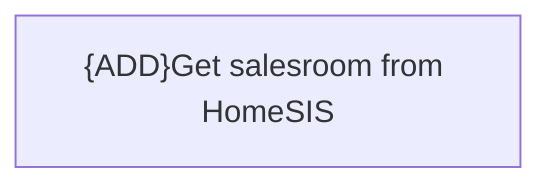

# Business Rules

- **Diagram Type**: Custom
- **Package**: HomerSelect/BSL/Modules/Commodity/Interface Consumed/HomeSIS API/Business Rules
- **Diagram ID**: 149642
- **Elements**: 1
- **Connectors**: 0

