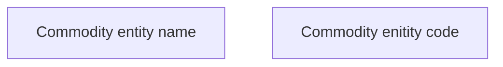

# COMMON for Commodity REST API

- **Diagram Type**: Custom
- **Package**: HomerSelect/BSL/Modules/Commodity/Interface Provided/Commodity API/COMMON for Commodity REST API
- **Diagram ID**: 160972
- **Elements**: 2
- **Connectors**: 0

