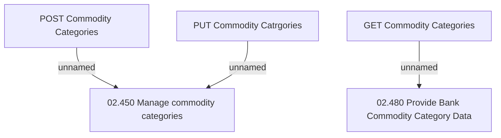

# Access Rights

```mermaid
graph TD
    n_02_450_Manage_commodity_categories["02.450 Manage commodity categories"]
    PUT_Commodity_Catrgories["PUT Commodity Catrgories"]
    POST_Commodity_Categories["POST Commodity Categories"]
    GET_Commodity_Categories["GET Commodity Categories"]
    n_02_480_Provide_Bank_Commodity_Category_Data["02.480 Provide Bank Commodity Category Data"]
    POST_Commodity_Categories -->|unnamed| n_02_450_Manage_commodity_categories
    GET_Commodity_Categories -->|unnamed| n_02_480_Provide_Bank_Commodity_Category_Data
    PUT_Commodity_Catrgories -->|unnamed| n_02_450_Manage_commodity_categories
```
