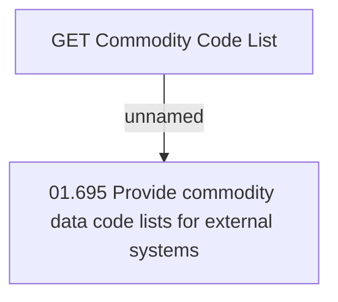

# Access Rights

- **Diagram Type**: Custom
- **Package**: HomerSelect/BSL/Modules/Commodity/Interface Provided/Commodity API/Commodity Code List/Access Rights
- **Diagram ID**: 125938
- **Elements**: 2
- **Connectors**: 1

