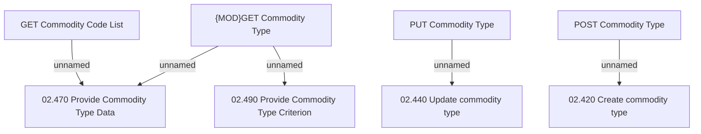

# Access Rights

- **Diagram Type**: Custom
- **Package**: HomerSelect/BSL/Modules/Commodity/Interface Provided/Commodity API/Commodity Type/Access Rights
- **Diagram ID**: 130290
- **Elements**: 8
- **Connectors**: 5

