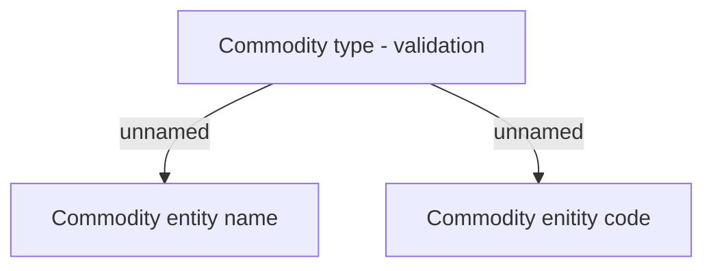

# Validation Rules

- **Diagram Type**: Custom
- **Package**: HomerSelect/BSL/Modules/Commodity/Interface Provided/Commodity API/Commodity Type/Validation Rules
- **Diagram ID**: 160942
- **Elements**: 3
- **Connectors**: 2

