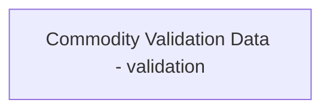

# Validation Rules

- **Diagram Type**: Custom
- **Package**: HomerSelect/BSL/Modules/Commodity/Interface Provided/Commodity API/Commodity Validation Data/Validation Rules
- **Diagram ID**: 125958
- **Elements**: 1
- **Connectors**: 0

