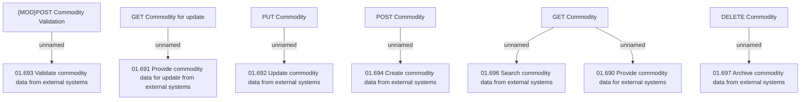

# Access Rights

```mermaid
graph TD
    n_01_696_Search_commodity_data_from_external_systems["01.696 Search commodity data from external systems"]
    n_01_697_Archive_commodity_data_from_external_systems["01.697 Archive commodity data from external systems"]
    n_01_694_Create_commodity_data_from_external_systems["01.694 Create commodity data from external systems"]
    n_01_693_Validate_commodity_data_from_external_systems["01.693 Validate commodity data from external systems"]
    n_01_692_Update_commodity_data_from_external_systems["01.692 Update commodity data from external systems"]
    n_01_691_Provide_commodity_data_for_update_from_external_sys["01.691 Provide commodity data for update from external systems"]
    n_01_690_Provide_commodity_data_for_external_systems["01.690 Provide commodity data for external systems"]
    MOD_POST_Commodity_Validation["{MOD}POST Commodity Validation"]
    GET_Commodity_for_update["GET Commodity for update"]
    PUT_Commodity["PUT Commodity"]
    POST_Commodity["POST Commodity"]
    GET_Commodity["GET Commodity"]
    DELETE_Commodity["DELETE Commodity"]
    GET_Commodity -->|unnamed| n_01_696_Search_commodity_data_from_external_systems
    GET_Commodity -->|unnamed| n_01_690_Provide_commodity_data_for_external_systems
    POST_Commodity -->|unnamed| n_01_694_Create_commodity_data_from_external_systems
    MOD_POST_Commodity_Validation -->|unnamed| n_01_693_Validate_commodity_data_from_external_systems
    PUT_Commodity -->|unnamed| n_01_692_Update_commodity_data_from_external_systems
    GET_Commodity_for_update -->|unnamed| n_01_691_Provide_commodity_data_for_update_from_external_sys
    DELETE_Commodity -->|unnamed| n_01_697_Archive_commodity_data_from_external_systems
```
