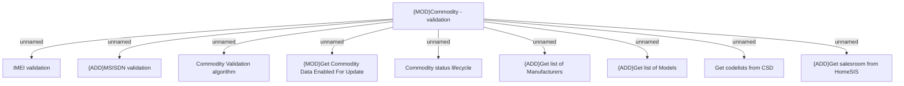

# Validation Rules

```mermaid
graph TD
    ADD_Get_salesroom_from_HomeSIS["{ADD}Get salesroom from HomeSIS"]
    Get_codelists_from_CSD["Get codelists from CSD"]
    ADD_Get_list_of_Models["{ADD}Get list of Models"]
    ADD_Get_list_of_Manufacturers["{ADD}Get list of Manufacturers"]
    Commodity_status_lifecycle["Commodity status lifecycle"]
    MOD_Get_Commodity_Data_Enabled_For_Update["{MOD}Get Commodity Data Enabled For Update"]
    Commodity_Validation_algorithm["Commodity Validation algorithm"]
    ADD_MSISDN_validation["{ADD}MSISDN validation"]
    IMEI_validation["IMEI validation"]
    MOD_Commodity_validation["{MOD}Commodity - validation"]
    MOD_Commodity_validation -->|unnamed| IMEI_validation
    MOD_Commodity_validation -->|unnamed| ADD_MSISDN_validation
    MOD_Commodity_validation -->|unnamed| Commodity_Validation_algorithm
    MOD_Commodity_validation -->|unnamed| MOD_Get_Commodity_Data_Enabled_For_Update
    MOD_Commodity_validation -->|unnamed| Commodity_status_lifecycle
    MOD_Commodity_validation -->|unnamed| ADD_Get_list_of_Manufacturers
    MOD_Commodity_validation -->|unnamed| ADD_Get_list_of_Models
    MOD_Commodity_validation -->|unnamed| Get_codelists_from_CSD
    MOD_Commodity_validation -->|unnamed| ADD_Get_salesroom_from_HomeSIS
```
