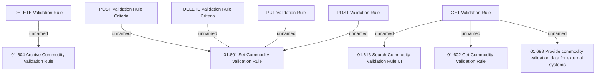

# Access Rights

```mermaid
graph TD
    n_01_602_Get_Commodity_Validation_Rule["01.602 Get Commodity Validation Rule"]
    n_01_613_Search_Commodity_Validation_Rule_UI["01.613 Search Commodity Validation Rule UI"]
    DELETE_Validation_Rule["DELETE Validation Rule"]
    n_01_604_Archive_Commodity_Validation_Rule["01.604 Archive Commodity Validation Rule"]
    n_01_601_Set_Commodity_Validation_Rule["01.601 Set Commodity Validation Rule"]
    DELETE_Validation_Rule_Criteria["DELETE Validation Rule Criteria"]
    PUT_Validation_Rule["PUT Validation Rule"]
    POST_Validation_Rule_Criteria["POST Validation Rule Criteria"]
    POST_Validation_Rule["POST Validation Rule"]
    GET_Validation_Rule["GET Validation Rule"]
    n_01_698_Provide_commodity_validation_data_for_external_syst["01.698 Provide commodity validation data for external systems"]
    POST_Validation_Rule_Criteria -->|unnamed| n_01_601_Set_Commodity_Validation_Rule
    DELETE_Validation_Rule -->|unnamed| n_01_604_Archive_Commodity_Validation_Rule
    DELETE_Validation_Rule_Criteria -->|unnamed| n_01_601_Set_Commodity_Validation_Rule
    PUT_Validation_Rule -->|unnamed| n_01_601_Set_Commodity_Validation_Rule
    GET_Validation_Rule -->|unnamed| n_01_613_Search_Commodity_Validation_Rule_UI
    GET_Validation_Rule -->|unnamed| n_01_602_Get_Commodity_Validation_Rule
    POST_Validation_Rule -->|unnamed| n_01_601_Set_Commodity_Validation_Rule
    GET_Validation_Rule -->|unnamed| n_01_698_Provide_commodity_validation_data_for_external_syst
```
