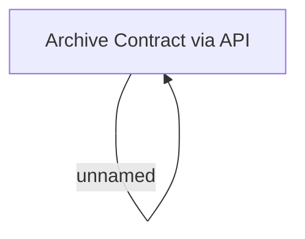

# Access Rights

- **Diagram Type**: Custom
- **Package**: HomerSelect/BSL/Modules/Contract Management (COMA)/Analytical Model/Contract Operations/Contract Archivation/Access Rights
- **Diagram ID**: 162025
- **Elements**: 2
- **Connectors**: 1

