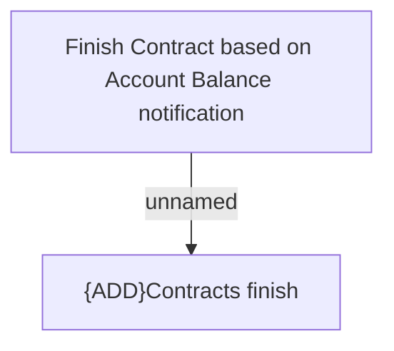

# Access Rights

- **Diagram Type**: Custom
- **Package**: HomerSelect/BSL/Modules/Contract Management (COMA)/Analytical Model/Contract Operations/Contract Finishing/Access Rights
- **Diagram ID**: 156329
- **Elements**: 2
- **Connectors**: 1

