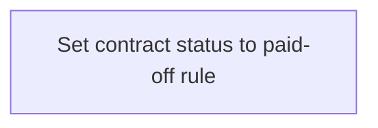

# Business Rules

- **Diagram Type**: Custom
- **Package**: HomerSelect/BSL/Modules/Contract Management (COMA)/Analytical Model/Contract Operations/Contract Pay-off/Business Rules
- **Diagram ID**: 156332
- **Elements**: 1
- **Connectors**: 0

