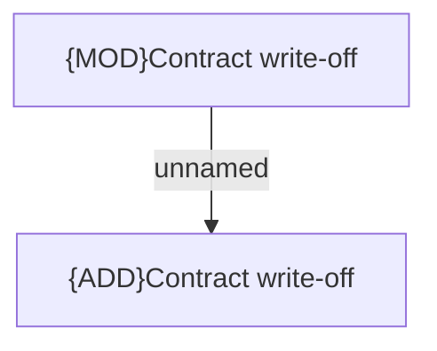

# Access Rights

```mermaid
graph TD
    MOD_Contract_write_off["{MOD}Contract write-off"]
    ADD_Contract_write_off["{ADD}Contract write-off"]
    MOD_Contract_write_off -->|unnamed| ADD_Contract_write_off
```
