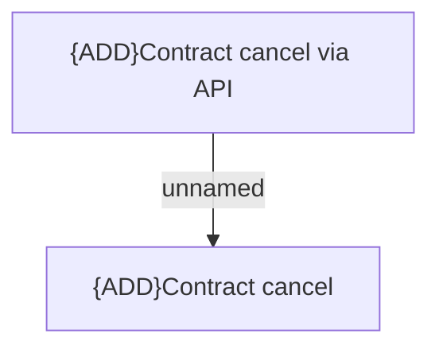

# Access Rights

```mermaid
graph TD
    ADD_Contract_cancel_via_API["{ADD}Contract cancel via API"]
    ADD_Contract_cancel["{ADD}Contract cancel"]
    ADD_Contract_cancel_via_API -->|unnamed| ADD_Contract_cancel
```
