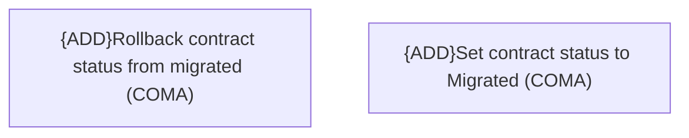

# Business Rules

```mermaid
graph TD
    ADD_Rollback_contract_status_from_migrated_COMA["{ADD}Rollback contract status from migrated (COMA)"]
    ADD_Set_contract_status_to_Migrated_COMA["{ADD}Set contract status to Migrated (COMA)"]
```
