# Access Rights

- **Diagram Type**: Custom
- **Package**: HomerSelect/BSL/Modules/Contract Management (COMA)/Analytical Model/Contracts Maintenance/Contract Status Revert/Access Rights
- **Diagram ID**: 156338
- **Elements**: 20
- **Connectors**: 18

```mermaid
graph TD
    ADD_15_110_Process_Contract_Status_Revert_on_external_reques["{ADD}15.110 Process Contract Status Revert on external request"]
    ADD_15_110_Process_Contract_Status_Revert_on_external_reques["{ADD}15.110 Process Contract Status Revert on external request"]
    ADD_Contracts_revert_Written_off_contract_to_Paid_off["{ADD}Contracts revert Written-off contract to Paid-off"]
    ADD_15_106_Revert_Paid_off_contract_to_Signed["{ADD}15.106 Revert Paid-off contract to Signed"]
    ADD_15_107_Revert_Paid_off_contract_to_Active["{ADD}15.107 Revert Paid-off contract to Active"]
    ADD_15_105_Revert_Paid_off_contract["{ADD}15.105 Revert Paid-off contract"]
    ADD_15_103_Revert_Canceled_contract_to_Active["{ADD}15.103 Revert Canceled contract to Active"]
    ADD_15_104_Revert_Canceled_contract_to_Paid_off["{ADD}15.104 Revert Canceled contract to Paid-off "]
    ADD_15_102_Revert_Canceled_contract_to_Signed["{ADD}15.102 Revert Canceled contract to Signed"]
    ADD_15_101_Revert_Canceled_contract["{ADD}15.101 Revert Canceled contract"]
    ADD_15_100_Change_contract_status["{ADD}15.100 Change contract status"]
    ADD_15_100_Change_contract_status["{ADD}15.100 Change contract status"]
    ADD_15_106_Revert_Paid_off_contract_to_Signed["{ADD}15.106 Revert Paid-off contract to Signed"]
    ADD_15_107_Revert_Paid_off_contract_to_Active["{ADD}15.107 Revert Paid-off contract to Active"]
    ADD_15_105_Revert_Paid_off_contract["{ADD}15.105 Revert Paid-off contract"]
    ADD_15_104_Revert_Canceled_contract_to_Paid_off["{ADD}15.104 Revert Canceled contract to Paid-off "]
    ADD_15_103_Revert_Canceled_contract_to_Active["{ADD}15.103 Revert Canceled contract to Active"]
    ADD_15_102_Revert_Canceled_contract_to_Signed["{ADD}15.102 Revert Canceled contract to Signed"]
    ADD_15_101_Revert_Canceled_contract["{ADD}15.101 Revert Canceled contract"]
    MOD_Contracts_revert_Written_off_contract_to_Paid_off["{MOD}Contracts revert Written-off contract to Paid-off"]
    ADD_15_101_Revert_Canceled_contract -->|unnamed| ADD_15_100_Change_contract_status
    MOD_Contracts_revert_Written_off_contract_to_Paid_off -->|unnamed| ADD_15_100_Change_contract_status
    ADD_15_105_Revert_Paid_off_contract -->|unnamed| ADD_15_100_Change_contract_status
    ADD_15_100_Change_contract_status -->|unnamed| ADD_15_100_Change_contract_status
    MOD_Contracts_revert_Written_off_contract_to_Paid_off -->|unnamed| ADD_Contracts_revert_Written_off_contract_to_Paid_off
    ADD_15_106_Revert_Paid_off_contract_to_Signed -->|unnamed| ADD_15_105_Revert_Paid_off_contract
    ADD_15_106_Revert_Paid_off_contract_to_Signed -->|unnamed| ADD_15_106_Revert_Paid_off_contract_to_Signed
    ADD_15_103_Revert_Canceled_contract_to_Active -->|unnamed| ADD_15_103_Revert_Canceled_contract_to_Active
    ADD_15_103_Revert_Canceled_contract_to_Active -->|unnamed| ADD_15_101_Revert_Canceled_contract
    ADD_15_107_Revert_Paid_off_contract_to_Active -->|unnamed| ADD_15_105_Revert_Paid_off_contract
    ADD_15_107_Revert_Paid_off_contract_to_Active -->|unnamed| ADD_15_107_Revert_Paid_off_contract_to_Active
    ADD_15_102_Revert_Canceled_contract_to_Signed -->|unnamed| ADD_15_101_Revert_Canceled_contract
    ADD_15_102_Revert_Canceled_contract_to_Signed -->|unnamed| ADD_15_102_Revert_Canceled_contract_to_Signed
    ADD_15_104_Revert_Canceled_contract_to_Paid_off -->|unnamed| ADD_15_101_Revert_Canceled_contract
    ADD_15_101_Revert_Canceled_contract -->|unnamed| ADD_15_101_Revert_Canceled_contract
    ADD_15_104_Revert_Canceled_contract_to_Paid_off -->|unnamed| ADD_15_104_Revert_Canceled_contract_to_Paid_off
    ADD_15_110_Process_Contract_Status_Revert_on_external_reques -->|unnamed| ADD_15_110_Process_Contract_Status_Revert_on_external_reques
    ADD_15_105_Revert_Paid_off_contract -->|unnamed| ADD_15_105_Revert_Paid_off_contract
```

