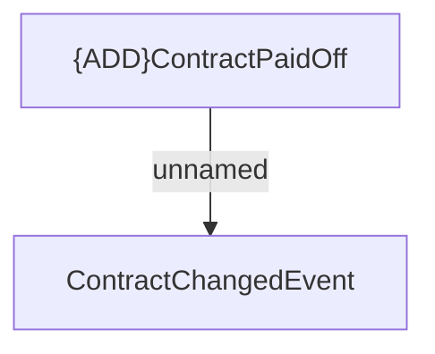

# ContractPaidOff

- **Diagram Type**: Custom
- **Package**: HomerSelect/BSL/Modules/Contract Management (COMA)/Interface Provided/Kafka/Events/v1/ContractPaidOff
- **Diagram ID**: 156334
- **Elements**: 2
- **Connectors**: 1

