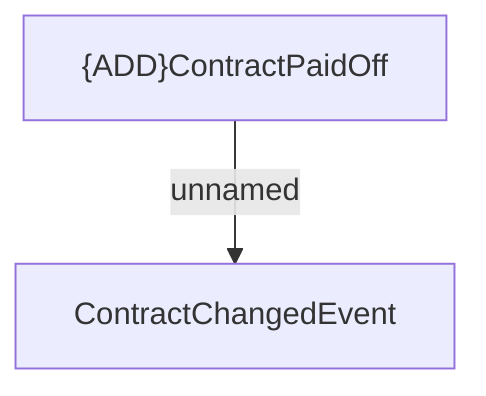

# ContractPaidOff

```mermaid
graph TD
    ContractChangedEvent["ContractChangedEvent"]
    ADD_ContractPaidOff["{ADD}ContractPaidOff"]
    ADD_ContractPaidOff -->|unnamed| ContractChangedEvent
```
