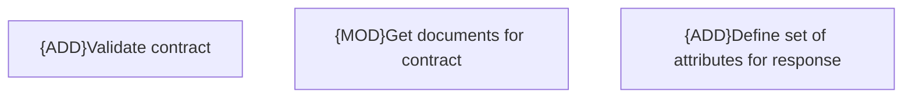

# Business Rules

- **Diagram Type**: Custom
- **Package**: HomerSelect/BSL/Modules/Contract Management (COMA)/Interface Provided/REST/Business Rules
- **Diagram ID**: 156224
- **Elements**: 3
- **Connectors**: 0

