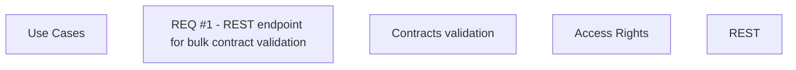

# CBL-11068 (CLM-3748) REST endpoint for bulk contract validation

- **Diagram Type**: Custom
- **Package**: HomerSelect/BSL/Modules/Contract Management (COMA)/Requirements/CBL-11068/CLM-3748 - REST endpoint for bulk contract validation
- **Diagram ID**: 156250
- **Elements**: 5
- **Connectors**: 0

