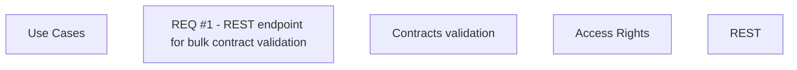

# CBL-11068 (CLM-3748) REST endpoint for bulk contract validation

```mermaid
graph TD
    Use_Cases["Use Cases"]
    REQ_1_REST_endpoint_for_bulk_contract_validation["REQ #1 - REST endpoint for bulk contract validation"]
    Contracts_validation["Contracts validation"]
    Access_Rights["Access Rights"]
    REST["REST"]
```
