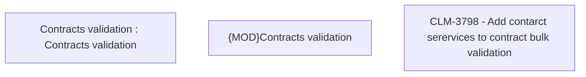

# CBL-11068 (CLM-3798) - Add new types of validation - serviceAssigned, serviceNotAssigned

- **Diagram Type**: Custom
- **Package**: HomerSelect/BSL/Modules/Contract Management (COMA)/Requirements/CBL-11068/CLM-3798 - Add new types of validation - serviceAssigned, serviceNotAssigned
- **Diagram ID**: 156251
- **Elements**: 3
- **Connectors**: 0

