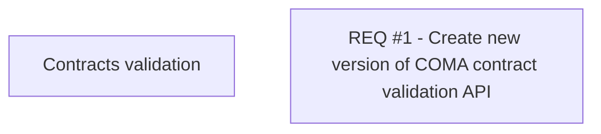

# CLM-4315 - Create new version of COMA contract validation API

- **Diagram Type**: Custom
- **Package**: HomerSelect/BSL/Modules/Contract Management (COMA)/Requirements/CBL-11068/CLM-4315 - Create new version of COMA contract validation API
- **Diagram ID**: 156253
- **Elements**: 2
- **Connectors**: 0

