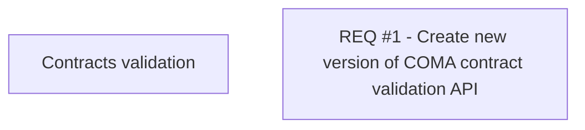

# CLM-4315 - Create new version of COMA contract validation API

```mermaid
graph TD
    Contracts_validation["Contracts validation"]
    REQ_1_Create_new_version_of_COMA_contract_validation_API["REQ #1 - Create new version of COMA contract validation API"]
```
