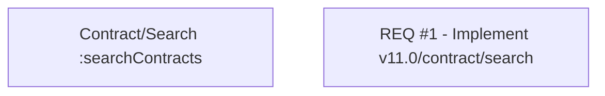

# CBL-11677 (CLM-3703) - Client center - Tab List of Contracts

- **Diagram Type**: Custom
- **Package**: HomerSelect/BSL/Modules/Contract Management (COMA)/Requirements/CBL-11677 (CLM-3703) - Client center - Tab List of Contracts
- **Diagram ID**: 156096
- **Elements**: 2
- **Connectors**: 0

