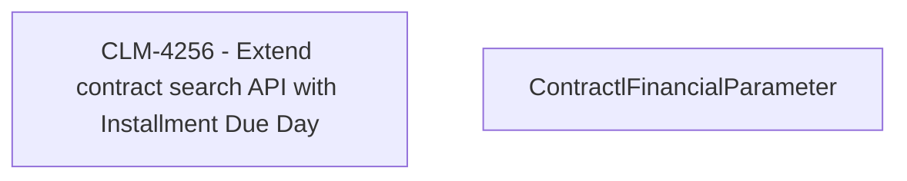

# CBL-12216 (CLM-3983) - Extend contract search API with Installment Due Day 

- **Diagram Type**: Custom
- **Package**: HomerSelect/BSL/Modules/Contract Management (COMA)/Requirements/CBL-12216 (CLM-3983) - Extend contract search API with Installment Due Day 
- **Diagram ID**: 156098
- **Elements**: 2
- **Connectors**: 0

