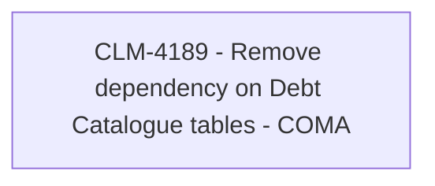

# CLM-4189 - Remove dependency on Debt Catalogue tables - COMA

- **Diagram Type**: Custom
- **Package**: HomerSelect/BSL/Modules/Contract Management (COMA)/Requirements/CBL-12580/CLM-4189 - Remove dependency on Debt Catalogue tables - COMA
- **Diagram ID**: 156226
- **Elements**: 1
- **Connectors**: 0

