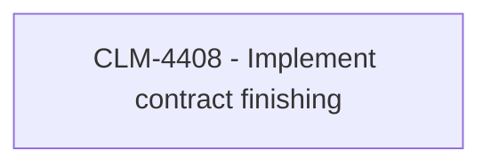

# CLM-4408 - Remove job contract finishing - COMA - Finish contract

- **Diagram Type**: Custom
- **Package**: HomerSelect/BSL/Modules/Contract Management (COMA)/Requirements/CBL-12580/CLM-4408 - Remove job contract finishing - COMA - Finish contract
- **Diagram ID**: 156227
- **Elements**: 1
- **Connectors**: 0

