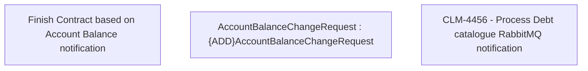

# CLM-4456 Process Debt catalogue RabbitMQ notification

- **Diagram Type**: Custom
- **Package**: HomerSelect/BSL/Modules/Contract Management (COMA)/Requirements/CBL-12580/CLM-4456 Process Debt catalogue RabbitMQ notification
- **Diagram ID**: 156228
- **Elements**: 3
- **Connectors**: 0

