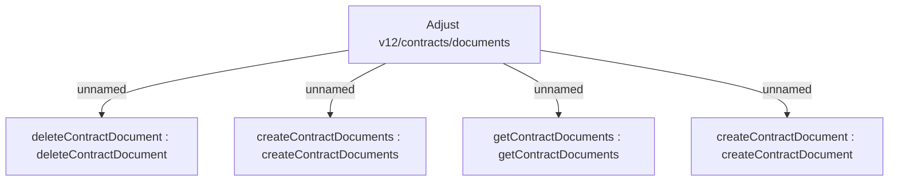

# CLM-4622 Integration to DMS module - COMA - Adjust v12/contracts/documents

- **Diagram Type**: Custom
- **Package**: HomerSelect/BSL/Modules/Contract Management (COMA)/Requirements/CBL-12588 DMS - Integrate Document management component in HoSel system/CLM-4622 Integration to DMS module - COMA - Adjust v12/contracts/documents
- **Diagram ID**: 156230
- **Elements**: 5
- **Connectors**: 4

